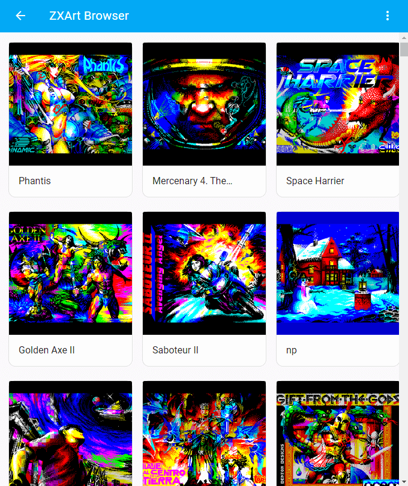
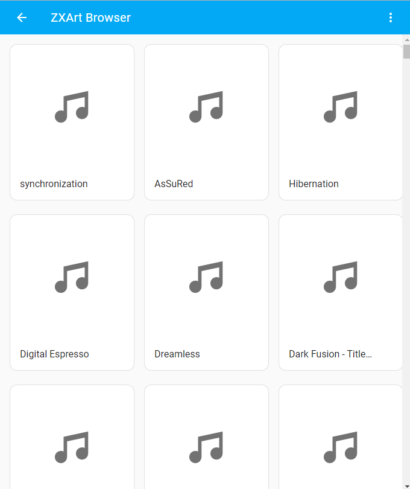

# ZXArt Browser

[Home Assistant](https://www.home-assistant.io/) [HACS](https://hacs.xyz/) custom component for working with [ZXArt.ee](https://zxart.ee) resources.

## Installation

### HACS

Follow [this guide](https://hacs.xyz/docs/faq/custom_repositories/) to add this git repository as a custom HACS repository. Then install from HACS as normal.

### Manual Installation

Copy `custom_components/zxart_browser` into your Home Assistant `$HA_HOME/config` directory, then restart Home Assistant.

## Support

If you find the component useful and want to support me and my work, you can do this by sending me a donation in [TONs](https://ton.org/): `UQCji6LsYAYrJP-Rij7SPjJcL0wkblVDmIkoWVpvP2YydnlA`.
